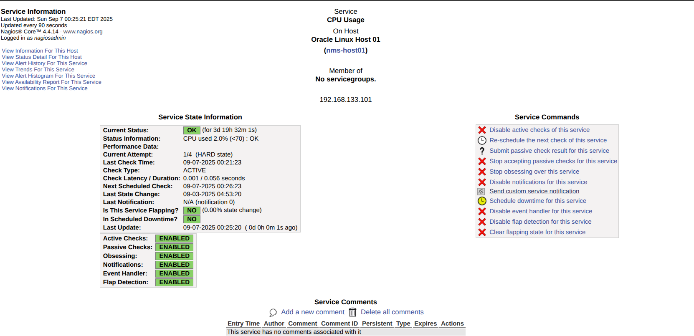

# Nagios Core Setup

## **Step 1: Install Nagios Core on `nms-server`**

In this example there will be three hosts on virtualbox or vmware.

### Prerequisites

- nms-server.joy.local [192.168.133.100]
- nms-host01.joy.local [192.168.133.101]
- nms-host02.joy.local [192.168.133.102]
- mail01.joy.local [192.168.133.103] --> This is a postfix relay server.

### **Step 1: Enable EPEL Repo on Oracle Linux 8**

On your `nms-server`:

```bash
sudo dnf install -y oracle-epel-release-el8
```

This provides the `ol8_developer_EPEL` repo which contains Nagios Core + plugins.

---

### **Step 2: Install Nagios and Plugins**

```bash
sudo dnf install -y nagios nagios-plugins-ping nagios-plugins-ssh nagios-plugins-http nagios-plugins-disk nagios-plugins-load
```

⚠️ Even though `nagios-plugins-nrpe` is included, we don’t have to use NRPE (we'll rely on ping, SNMP).

---

### **Step 3: Start Services**

```bash
sudo systemctl enable nagios httpd
sudo systemctl start nagios httpd
```

---

### **Step 4: Configure Web Access**

Nagios web UI runs on Apache. Create a web user:

```bash
sudo htpasswd -c /etc/nagios/passwd nagiosadmin
```

Set password (example: `nagios123`).

Now go to:
👉 `http://192.168.133.100/nagios`
Login with `nagiosadmin / nagios123`.

---

### **Step 5: Add Hosts & Services**

Config files are in:

```text
/etc/nagios/objects/hosts.cfg
/etc/nagios/nagios.cfg
```

***Create and Edit `/etc/nagios/objects/hosts.cfg`.***

```bash

###############################################################################
# Host Definitions
###############################################################################

# Define first host: nms-host01
define host {
    use             linux-server     ; Template to inherit defaults from
    host_name       nms-host01       ; Short name (used internally in Nagios)
    alias           Oracle Linux Host 01 ; Friendly display name in UI
    address         192.168.133.101  ; IP address of the host
}

# Define second host: nms-host02
define host {
    use             linux-server
    host_name       nms-host02
    alias           Oracle Linux Host 02
    address         192.168.133.102
}
```

***Also include the path to `/etc/nagios/nagios.cfg`***

```bash
cfg_file=/usr/local/nagios/etc/objects/hosts.cfg
```

***Now Add basic hosts check on `/etc/nagios/objects/services.cfg`***

```bash
define service {
    use                     generic-service
    host_name               nms-host01
    service_description     PING
    check_command           check_ping!100.0,20%!500.0,60%
}

define service {
    use                     generic-service
    host_name               nms-host02
    service_description     PING
    check_command           check_ping!100.0,20%!500.0,60%
}

define service {
    use                     generic-service
    host_name               nms-host01
    service_description     SSH Port
    check_command           check_tcp!22
}

define service {
    use                     generic-service
    host_name               nms-host02
    service_description     SSH Port
    check_command           check_tcp!22
}
```

after adding **ping and TCP checks** as services.
configure the nagios cfg file with nagios with the following command:

```bash
sudo nagios -v /etc/nagios/nagios.cfg
```

Finally, restart:

```bash
sudo systemctl restart nagios
```

---

Now we will install snmp v3 in both hosts for further cpu, memory and disk monitoring.

## **Step 1: Install SNMP on the hosts**

On **nms-host01** and **nms-host02**:

```bash
sudo dnf install -y net-snmp net-snmp-utils
```

---

## **Step 2: Create SNMPv3 user**

Run on each host:

```bash
sudo net-snmp-create-v3-user -ro -A "yourpassword123" -X "yourpassword123" -a SHA -x AES nagios
```

Explanation:

| Option   | Meaning                       |
| -------- | ----------------------------- |
| `-ro`    | Read-only access              |
| `-A`     | Authentication password       |
| `-X`     | Privacy (encryption) password |
| `-a SHA` | Authentication protocol SHA   |
| `-x AES` | Encryption protocol AES       |
| `nagios` | SNMPv3 username               |

This automatically updates `/var/lib/net-snmp/snmpd.conf`, `/etc/snmp/snmpd.conf` and sets permissions.

---

## **Step 3: Enable and start SNMP daemon**

```bash
sudo systemctl enable snmpd
sudo systemctl restart snmpd
```

Check status:

```bash
sudo systemctl status snmpd
```

---

## **Step 4: Test SNMPv3 from Nagios server**

On `nms-server`:

```bash
snmpwalk -v3 -l authPriv -u nagios -a SHA -A "yourpassword123" -x AES -X "yourencryption123" 192.168.133.101 system
snmpwalk -v3 -l authPriv -u nagios -a SHA -A "yourpassword123" -x AES -X "yourencryption123" 192.168.133.102 system
```

* `-v3` → SNMPv3
* `-l authPriv` → Authentication + encryption
* `-u nagios` → username
* `-a SHA` → auth protocol
* `-A "yourpassword123"` → auth password
* `-x AES` → encryption protocol
* `-X "yourencryption123"` → encryption password

You should get system info if configured correctly ✅

---

## **Step 5: Download Plugins for CPU usage , memory  usage, load**

```hyperlink
https://sources.debian.org/src/nagios-snmp-plugins/2.1.0-1/plugins/
```

Download the following plugins:

- check_snmp_mem.pl --> memory usage
- check_snmp_load.pl --> load average, cpu usage
- check_snmp_storage.pl --> disk usage

Place them in `/usr/lib64/nagios/plugins/` and make executable:

```bash
sudo chmod +x /usr/lib64/nagios/plugins/check_snmp_*.pl
```

## **Step 6: Add the following to /etc/nagios/objects/services.cfg**

```cfg
# Check CPU usage (using ssCpuIdle.0)
define service{
    use                     generic-service
    host_name               nms-host01
    service_description     CPU Usage
    contacts                adminjoy
    check_interval          5
    check_command           check_snmp_cpu!70!90
    # Warning if CPU usage > 70%, Critical if > 90%
}

# Check Memory usage (using memAvailReal.0 and memTotalReal.0)
define service{
    use                     generic-service
    host_name               nms-host01
    service_description     Memory Usage
    contacts                adminjoy
    check_interval          1
    check_command           check_snmp_mem!90,20!95,50
    # Warning if available memory < 30%, Critical if < 10%
}

define service {
        use                             generic-service
        host_name                       nms-host01
        service_description             DISK- /
        contacts                        adminjoy
        check_command                   check_snmp_storage!12!10!/
        }


define service {
        use                             generic-service
        host_name                       nms-host01
        service_description             Load AVG
        contacts                        adminjoy
        check_command                   check_snmp_load!8,8,8!9,9,9
        }

```

```cfg
# CPU usage via SNMPv3
define service {
    use                     generic-service
    host_name               nms-host01
    service_description     CPU Usage
    check_command           check_snmp!-v 3 -l authPriv -u nagios -a SHA -A "AuthPassword123" -x AES -X "PrivPassword123" -o .1.3.6.1.4.1.2021.11.11.0 -w 70 -c 90
}

# Memory usage via SNMPv3
define service {
    use                     generic-service
    host_name               nms-host01
    service_description     Memory Usage
    check_command           check_snmp!-v 3 -l authPriv -u nagios -a SHA -A "AuthPassword123" -x AES -X "PrivPassword123" -o .1.3.6.1.4.1.2021.4.6.0 -w 70 -c 90
}

# Repeat for nms-host02
define service {
    use                     generic-service
    host_name               nms-host02
    service_description     CPU Usage
    check_command           check_snmp!-v 3 -l authPriv -u nagios -a SHA -A "AuthPassword123" -x AES -X "PrivPassword123" -o .1.3.6.1.4.1.2021.11.11.0 -w 70 -c 90
}

define service {
    use                     generic-service
    host_name               nms-host02
    service_description     Memory Usage
    check_command           check_snmp!-v 3 -l authPriv -u nagios -a SHA -A "AuthPassword123" -x AES -X "PrivPassword123" -o .1.3.6.1.4.1.2021.4.6.0 -w 70 -c 90
}
```

---

## **Step 7: Now we have to add commands so, add the following to /etc/nagios/objects/commands.cfg**

```cfg
define command {
        command_name    check_snmp_cpu
        command_line    $USER1$/check_snmp_load.pl -H $HOSTADDRESS$ -l $USER2$   -x $USER3$  -L sha,aes -X $USER4$  -w $ARG1$ -c $ARG2$ -T netsc
                }

define command {
        command_name    check_snmp_mem
        command_line    $USER1$/check_snmp_mem.pl -H $HOSTADDRESS$ -l  $USER2$  -x $USER3$  -L sha,aes -X $USER4$  -w $ARG1$ -c $ARG2$
                }
define command {
        command_name    check_snmp_storage
        command_line    $USER1$/check_snmp_storage.pl -H $HOSTADDRESS$ -l $USER2$  -x $USER3$  -L sha,aes -X $USER4$  -w $ARG1$ -c $ARG2$ -m $ARG3$ -r -T pl
                }

define command {
        command_name    check_snmp_load
        command_line    $USER1$/check_snmp_load.pl -H $HOSTADDRESS$  -l $USER2$ -x $USER3$  -L sha,aes -X $USER4$  -w $ARG1$ -c $ARG2$ -T netsl
                }
```

---

## **Step 8: Edit the private variables in `/etc/nagios/private`**

```cfg
$USER1$ = "/usr/lib64/nagios/plugins"
$USER2$ = "nagios"
$USER3$ = "yourpassword123"
$USER4$ = "yourencryption123"
```

---

## **Step 9: Edit the contacts in `/etc/nagios/objects/contacts.cfg`**

```cfg
define contact {
    contact_name                    adminjoy
    alias                           Team OPS
    use                             generic-contact
    email                           joy@mail01.joy.local
    service_notification_commands   notify-by-email
    host_notification_commands      host-notify-by-email
}
```

***Now test everything and restart nagios***

```bash
sudo nagios -v /etc/nagios/nagios.cfg
sudo systemctl restart nagios
```

Open the Nagios UI → Hosts → CPU and Memory services should now show real-time values via **SNMPv3**.


You can verify the email alert by sending custom notifications from the Nagios UI or you can stop the snmpd service on one of the hosts to trigger an alert.

