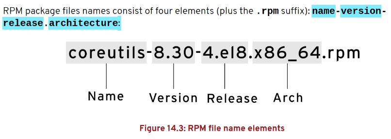

# Chapter 14 - Install and Update Software Packages

## Key Concepts

- **Package Management**:
  - Software is distributed as **RPM packages** (`.rpm` files) containing binaries, libraries, and documentation.
  - Managed by **DNF** (Dandified Yum), the default package manager in RHEL 9/10, replacing `yum`.
- **Red Hat Subscription Management**:
  - Required for access to Red Hat repositories (BaseOS, AppStream).
  - Managed via `subscription-manager` to register systems and attach entitlements.
- **Repositories**:
  - Configured in `/etc/yum.repos.d/` (`.repo` files).
  - **BaseOS**: Core OS packages.
  - **AppStream**: Modular content (e.g., Node.js, Python streams).
- **RPM**:
  - Low-level tool for direct `.rpm` file management.
  - Used for querying or installing local RPMs when DNF is unavailable.
- **AppStream Modules**:
  - Provide multiple versions of software (e.g., Node.js 18, 20).
  - Organized as modules, streams, and profiles.

### Registering Systems for Red Hat Support

- **Purpose**: Connects RHEL systems to Red Hat’s subscription services for package updates and support.
- **Tool**: `subscription-manager`.
- **Examples**:
  1. Check subscription status:

     ```bash
     subscription-manager status
     ```

  2. List available subscriptions:

     ```bash
     subscription-manager list --available
     ```

  3. Corner Case: No subscription:

     ```bash
     dnf repolist
     # Error: No repositories available
     # Fix: Register system (see below)
     ```

### Red Hat Subscription Management

- **Components**:
  - **Entitlement Certificates**: Stored in `/etc/pki/entitlement/`.
  - **Repositories**: Enabled after registration (e.g., `rhel-9-for-x86_64-baseos-rpms`).
- **Process**: Register, attach subscription, enable repositories.

### Registering a System

- **Command**: `subscription-manager register`.
- **Examples**:
  1. Register with Red Hat account:

     ```bash
     sudo subscription-manager register --username <user> --password <pass>
     ```

  2. Auto-attach subscription:

     ```bash
     sudo subscription-manager attach --auto
     ```

  3. Verify:

     ```bash
     subscription-manager status
     ```

  4. Corner Case: Invalid credentials:

     ```bash
     subscription-manager register
     # Error: Invalid username/password
     # Fix: Verify credentials or use activation key
     ```

### Registration From the Command Line

- **Options**:
  - `--auto-attach`: Automatically selects a subscription.
  - `--activationkey`: Uses a predefined key for registration.
- **Examples**:
  1. Register with activation key:

     ```bash
     sudo subscription-manager register --org <org_id> --activationkey <key>
     ```

  2. Enable repositories:

     ```bash
     sudo subscription-manager repos --enable rhel-9-for-x86_64-appstream-rpms
     ```

  3. Corner Case: Organization mismatch:

     ```bash
     subscription-manager register --org wrong_org
     # Error: Organization not found
     # Fix: Verify org ID with Red Hat account
     ```

### Entitlement Certificates

- **Purpose**: Prove subscription validity, stored in `/etc/pki/entitlement/`.
- **Commands**:
  - `subscription-manager list --consumed`: Show attached entitlements.
  - `subscription-manager refresh`: Update certificates.
- **Examples**:
  1. Check entitlements:

     ```bash
     subscription-manager list --consumed
     ```

  2. Refresh certificates:

     ```bash
     sudo subscription-manager refresh
     ```

  3. Corner Case: Expired certificate:

     ```bash
     dnf update
     # Error: No valid entitlement
     # Fix: subscription-manager refresh
     ```

### Explaining and Investigating RPM Software Packages

- **RPM**: Red Hat Package Manager, handles `.rpm` files directly.
   
- **Purpose**: Query or install packages without dependency resolution.
- **Examples**:
  1. Query installed package:

     ```bash
     rpm -qi httpd
     ```

  2. Find package owning a file:

     ```bash
     rpm -qf /usr/bin/vim
     ```

  3. Corner Case: RPM database corruption:

     ```bash
     rpm -qa
     # Error: Database corrupted
     # Fix: sudo rpm --rebuilddb
     ```

### Updating Software with RPM Packages

- **Command**: `rpm -Uvh` (upgrade) or `rpm -ivh` (install).
- **Note**: Prefer `dnf` for updates due to dependency handling.
- **Examples**:
  1. Upgrade local RPM:

     ```bash
     sudo rpm -Uvh httpd-2.4.57-1.el9.x86_64.rpm
     ```

  2. Verify:

     ```bash
     rpm -qa | grep httpd
     ```

  3. Corner Case: Dependency missing:

     ```bash
     rpm -Uvh package.rpm
     # Error: Missing dependency
     # Fix: Use dnf install package.rpm
     ```

### Examining RPM Packages

- **Commands**:
  - `rpm -ql`: List package files.
  - `rpm -qc`: List configuration files.
  - `rpm -qd`: List documentation.
- **Examples**:
  1. List files in `httpd`:

     ```bash
     rpm -ql httpd
     ```

  2. Check configuration files:

     ```bash
     rpm -qc httpd
     ```

  3. Corner Case: Package not installed:

     ```bash
     rpm -qi vim
     # Error: Not installed
     # Fix: dnf install vim
     ```

### Installing RPM Packages

- **Command**: `rpm -ivh` (install, verbose, hash progress).
- **Examples**:
  1. Install local RPM:

     ```bash
     sudo rpm -ivh package.rpm
     ```

  2. Verify installation:

     ```bash
     rpm -qa | grep package
     ```

  3. Corner Case: Already installed:

     ```bash
     rpm -ivh package.rpm
     # Error: Package installed
     # Fix: Use rpm -Uvh for upgrade
     ```

### Summary of RPM Query Commands

- **Key Commands**:
  - `rpm -qa`: List all installed packages.
  - `rpm -qi <package>`: Show package info.
  - `rpm -ql <package>`: List files.
  - `rpm -qf <file>`: Find package owning file.
  - `rpm -qc <package>`: List config files.
- **Example**:
  - Comprehensive query:

    ```bash
    rpm -qa | grep httpd
    rpm -qi httpd
    rpm -ql httpd | head
    ```

### Installing and Updating Software Packages with YUM

- **Note**: In RHEL 9/10, `yum` is a symbolic link to `dnf` for compatibility.
- **Commands**: Same as `dnf` (e.g., `yum install`, `yum update`).
- **Examples**:
  1. Install package:

     ```bash
     sudo yum install -y tree
     ```

  2. Update system:

     ```bash
     sudo yum update -y
     ```

  3. Corner Case: `yum` not found:

     ```bash
     # Fix: Use dnf (yum is dnf in RHEL 9/10)
     ```

### Managing Software Packages with YUM

- **Purpose**: Install, update, remove, and query packages using `yum`/`dnf`.
- **Examples**:
  1. Search for a package:

     ```bash
     yum search nginx
     ```

  2. Remove package:

     ```bash
     sudo yum remove nginx
     ```

  3. Corner Case: Broken dependencies:

     ```bash
     yum remove package
     # Error: Dependency issue
     # Fix: dnf autoremove
     ```

### Summary of YUM Commands

- **Key Commands** (same as `dnf`):
  - `yum install <package>`: Install package.
  - `yum update`: Update all packages.
  - `yum remove <package>`: Remove package.
  - `yum list [installed|available]`: List packages.
  - `yum search <keyword>`: Search packages.
  - `yum info <package>`: Show package details.
  - `yum provides <file>`: Find package providing file.

### Enabling YUM Software Repositories

- **Purpose**: Enable access to additional packages (e.g., EPEL, AppStream).
- **Commands**:
  - `subscription-manager repos --enable`: Enable Red Hat repos.
  - `dnf install epel-release`: Add EPEL repo.
- **Examples**:
  1. Enable AppStream:

     ```bash
     sudo subscription-manager repos --enable rhel-9-for-x86_64-appstream-rpms
     ```

  2. Install EPEL:

     ```bash
     sudo dnf install -y epel-release
     ```

  3. Verify repos:

     ```bash
     dnf repolist
     ```

  4. Corner Case: Repo disabled:

     ```bash
     dnf install package
     # Error: No package available
     # Fix: subscription-manager repos --list
     ```

### Managing Package Module Streams

- **Introduction to Application Streams**:
  - AppStream provides modular content (e.g., multiple versions of Node.js, Python).
  - Organized as **modules**, **streams**, and **profiles**.
- **Modules**: Logical groups (e.g., `nodejs`, `python`).
- **Module Streams**: Specific versions (e.g., `nodejs:18`, `nodejs:20`).
- **Module Profiles**: Configurations (e.g., `minimal`, `default`).

### Managing Modules Using YUM

- **Commands**:
  - `dnf module list`: List modules.
  - `dnf module install`: Install a stream/profile.
  - `dnf module reset`: Reset module to default.
- **Examples**:
  1. List modules:

     ```bash
     dnf module list
     ```

  2. Install Node.js 18:

     ```bash
     sudo dnf module install nodejs:18
     ```

  3. Corner Case: Module conflict:

     ```bash
     dnf module install nodejs:20
     # Error: Module already enabled
     # Fix: dnf module reset nodejs
     ```

### Listing Modules

- **Command**: `dnf module list`.
- **Examples**:
  1. List all modules:

     ```bash
     dnf module list
     ```

  2. Filter for Python:

     ```bash
     dnf module list python
     ```

  3. Corner Case: No modules shown:

     ```bash
     dnf module list
     # Empty
     # Fix: Enable AppStream: subscription-manager repos --enable rhel-9-for-x86_64-appstream-rpms
     ```

### Enabling Module Streams and Installing Modules

- **Command**: `dnf module enable` or `dnf module install`.
- **Examples**:
  1. Enable Node.js 18:

     ```bash
     sudo dnf module enable nodejs:18
     ```

  2. Install with default profile:

     ```bash
     sudo dnf module install nodejs:18/default
     ```

  3. Verify:

     ```bash
     node --version
     ```

  4. Corner Case: Wrong stream:

     ```bash
     dnf module install nodejs:99
     # Error: Stream not found
     # Fix: dnf module list nodejs
     ```

### Removing Modules and Disabling Module Streams

- **Commands**:
  - `dnf module remove`: Remove installed module.
  - `dnf module reset`: Disable stream.
- **Examples**:
  1. Remove Node.js:

     ```bash
     sudo dnf module remove nodejs
     ```

  2. Reset module:

     ```bash
     sudo dnf module reset nodejs
     ```

  3. Corner Case: Module in use:

     ```bash
     dnf module remove nodejs
     # Error: Module in use
     # Fix: Stop services, then remove
     ```

### Switching Module Streams

- **Purpose**: Change between streams (e.g., Node.js 18 to 20).
- **Examples**:
  1. Switch to Node.js 20:

     ```bash
     sudo dnf module reset nodejs
     sudo dnf module install nodejs:20
     ```

  2. Verify:

     ```bash
     node --version
     ```

  3. Corner Case: Dependency conflict:

     ```bash
     dnf module install nodejs:20
     # Error: Conflict with nodejs:18
     # Fix: dnf module remove nodejs; dnf module install nodejs:20
     ```

### Practical Examples

1. **Register System and Install Web Server**:

   ```bash
   sudo subscription-manager register --username <user> --password <pass>
   sudo subscription-manager attach --auto
   sudo subscription-manager repos --enable rhel-9-for-x86_64-appstream-rpms
   sudo dnf install -y httpd
   sudo systemctl enable --now httpd
   ```

2. **Update System for Security**:

   ```bash
   sudo dnf update --security -y
   dnf check-update
   ```

3. **Install Development Tools**:

   ```bash
   sudo dnf groupinstall "Development Tools"
   gcc --version
   ```

4. **Manage Node.js Streams**:

   ```bash
   dnf module list nodejs
   sudo dnf module install nodejs:18/default
   node --version
   ```

5. **Query and Remove Package**:

   ```bash
   rpm -qa | grep tree
   sudo dnf remove tree
   dnf autoremove
   ```

### Common Pitfalls

- **No Subscription**: DNF fails without a valid subscription:

  ```bash
  subscription-manager status
  ```

- **Disabled Repos**: Packages unavailable if repos are disabled:

  ```bash
  sudo subscription-manager repos --enable rhel-9-for-x86_64-baseos-rpms
  ```

- **Using `rpm` Directly**: Causes dependency issues:

  ```bash
  rpm -ivh package.rpm
  # Error: Missing dependency
  # Fix: dnf install package.rpm
  ```

- **Stale Cache**: Outdated package lists:

  ```bash
  sudo dnf clean all
  sudo dnf makecache
  ```

- **Module Conflicts**: Multiple streams enabled:

  ```bash
  dnf module reset nodejs
  ```
